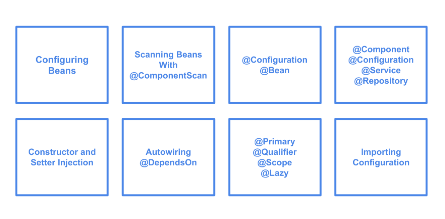

# Spring Overview

The Spring Framework consists of features organized into about 20 modules. 
These modules are grouped into **Core Container**, **Data Access/Integration**, **Web**, 
**AOP** (Aspect Oriented Programming), **Instrumentation**, **Messaging**, and **Test**, 
as shown in the following diagram.


Also, we can define Spring as:

“Spring framework is a Java platform that provides comprehensive infrastructure support for developing Java applications. Spring handles the infrastructure so you can focus on your application” 

In [this repository](https://github.com/filipednb/spring-core.git), we will focus to undertand how **Spring Core Container** works.
Each example will have a package that contains a main class that you can run to see it working.

## Introducing objects dependencies

A Java Application is a collection of Objects. In a good application we will have several objects with their own responsibilities. And those objects can be dependent on each other.

**Example:**

UserService depends on UserRepository

So a way to do is like this:

```java
public class UserService {
    
    private UserRepository repository;
        public UserService() {
        UserRepository repository = new UserRepository();
        this.repository = repository;
    
    }
    
    public void create() {
        repository.save(new User(1L, "Sebastian"));
    }

}
```
Note that we are in charge to instantiate objects that we need, as we can see in `respository` object:
`UserRepository repository = new UserRepository();` 

**Traditional Way of dependency injection - Drawbacks**

The developer are responsible to manage the object dependencies and object creation

He is also responsible for initializing and providing dependencies to child objects. It can be daunting when there are a large number of them

**Spring Way of dependency injection**


*   We only need to declare and let Spring inject the dependencies for us
*   Spring IoC container is here to help - We provide Spring container bean definitions and let it manage the object creation, initialization, assembling and also manage the dependency graph.
*   Bean definition can be provided through XML bean definition configuration file or through Java annotations

## How Spring IoC Container works


**Concept of POJOs and Beans**

“In software engineering, a **P**lain **O**ld **J**ava **O**bject (**POJO**) is an **ordinary Java object, not bound by any special restriction** and not requiring any class path”

A POJO cannot implement or extends any other classes that needs a class path.

When a POJO is inside of a Spring IoC container it is known as Beans.

## Spring IoC Container

The `org.springframework.beans` and `org.springframework.context` packages are the basis for Spring Framework's IoC container. The `BeanFactory` interface provides an advanced configuration mechanism capable of managing any type of object. `ApplicationContext` is a sub-interface of BeanFactory. It adds easier integration with Spring's AOP features; message resource handling (for use in internationalization), event publication; and application-layer specific contexts such as the `WebApplicationContext` for use in web applications.

In short, the `BeanFactory` provides the configuration framework and basic functionality, and the `ApplicationContext` adds more enterprise-specific functionality. The ApplicationContext is a complete superset of the BeanFactory

*   ApplicationContext interface represents the Spring IoC Container
*   It is responsible for instantiating, configuring, and assembling the beans
*   Container get its instructions on what objects to instantiate, configure and assemble by reading configuration metadata

There is two different ways of configuring a bean:

**Configuration Metadata - XML File**
`studying.spring.core.xml.config`

```xml
<?xml version="1.0" encoding="utf-8" ?>
<beans xmlns="http://www.springframework.org/schema/beans"
    xmlns:xsi="http://www.w3.org/2001/XMLSchema-instance"
    xsi:schemaLocation="http://www.springframework.org/schema/beans
    http://www.springframework.org/schema/beans/spring-beans.xsd">

    <bean id="product" class="studying.spring.core.xml.config.Product">
        <constructor-arg name="id" value="A123" />
        <constructor-arg name="name" value="Notebook" />
        <constructor-arg name="productDescription" value="Awesome notebook from Acer TM" />
    </bean>

    <bean id="product2" class="studying.spring.core.xml.config.Product">
        <constructor-arg name="id" value="B666" />
        <constructor-arg name="name" value="SmartPhone" />
        <constructor-arg name="productDescription" value="Very nice Fone" />
    </bean>
</beans>
```

**Configuration Metadata - Java Config**
`studying.spring.core.java.annotation.config`

```java
package spring.core.java.annotation.config;

import org.springframework.context.annotation.Bean;
import org.springframework.context.annotation.Configuration;import studying.spring.core.java.annotation.config.Artist;

@Configuration
public class ArtistConfiguration {

    @Bean
    public Artist artist() {
        return new Artist("Filipe", "Tagliacozzi");
    }

    /*@Bean("AnotherArtist")
    public Artist artist() {
        return new Artist("Sebastian", "Doe");
    }*/

}

```

In annotation configuration of a bean the method name will be the name of the bean inside IoC container or a name given in this way: 
```java
@Bean(name = "nameOfBean")
```
## BeanFactory Interface

*   Spring’s Dependency Injection functionality is implemented using this BeanFactory interface and its subinterfaces.
*   This is the root interface for accessing a Spring bean container
*   This is the basic client view of a bean container
*   This interface is implemented by objects that hold a number of bean definitions, each uniquely identified by a String name

## ApplicationContext Interface

*   Central interface to provide configuration for a Spring application
*   This is read-only while the application is running, but may be reloaded if the implementation support this
*   Implement various other interfaces that provides useful features, such as:
    *   EnvironmentCapable
    *   MessageSource
    *   ApplicationEventPublisher

**Demonstration**


**We can inject that dependency by Constructor or by a Setter method. **

Since you can mix constructor-based and setter-based dependency injection, it is a good rule that you use constructor for mandatory dependencies and setter for optional dependencies.

The Spring team generally advocates constructor injection as it lets you implement components as immutable objects and ensures that required dependencies are not null. Furthermore, constructor-injected components are always returned to the client code in a fully initialized state. As a side note, a large amount of constructor arguments is a bad code smell, implying that the class likely has too many responsibilities and should be refactored to better address proper separation of concerns.

Setter injection should primarily only be used for optional dependencies that can be assigned reasonable default values within the class. Otherwise, not-null checks must be performed everywhere the code uses the dependency. One benefit of setter injection is that you can reinject dependencies when you need to.

**Dependency Resolution Process**

*   The ApplicationContext is created and initialized with configuration metadata
*   For each bean, its dependencies are expressed in the form of properties, constructor arguments or arguments to the static-factory method
*   Each property or constructor argument that is a value is converted from its specified format to the actual type of that property or constructor argument
*   The Spring container validates the configuration of each bean as the container is created

**Circular Dependency**

*   If we use predominantly constructor injection, it is possible to create an unresolvable circular dependency scenario
*   For example: **Class A** requires an instance of **Class B** through constructor injection, and class B requires an instance of Class A through constructor injection.
*   If we configure beans for classes **A** and **B** to be injected into each other, the **Spring IoC** container detects this circular reference at runtime and throw a **BeanCurrentlyCreationException**


**Importing XML Configurations**
`studying.spring.core.bean.imports`


An example of importing bean configuration:

Declaring:
```xml
<?xml version="1.0" encoding="utf-8" ?>
<beans xmlns="http://www.springframework.org/schema/beans"
    xmlns:xsi="http://www.w3.org/2001/XMLSchema-instance"
    xsi:schemaLocation="http://www.springframework.org/schema/beans
    http://www.springframework.org/schema/beans/spring-beans.xsd">

    <bean id="instrument" class="studying.spring.core.bean.imports.Instrument">
        <property name="id" value="85" />
        <property name="name" value="Acoustic Guitar" />
    </bean>
</beans>
```

Importing:
```xml
<?xml version="1.0" encoding="utf-8" ?>
<beans xmlns="http://www.springframework.org/schema/beans"
    xmlns:xsi="http://www.w3.org/2001/XMLSchema-instance"
    xsi:schemaLocation="http://www.springframework.org/schema/beans
    http://www.springframework.org/schema/beans/spring-beans.xsd">

    <import resource="applicationContextBeanImport-instrument.xml" />

    <bean id="artist" class="studying.spring.core.bean.imports.Artist">
        <property name="name" value="Jhonny Boy" />
        <property name="instrument" ref="instrument" />
    </bean>
</beans>
```

**Inner Bean**

Another way of declaring a dependency bean inside another is defining a `<bean />` element inside the `<property />` or `<constructor-arg />` elements. It defines an inner bean.

```xml
<import resource="applicationContextBeanImport-instrument.xml" />

<bean id="artist" class="studying.spring.core.bean.imports.Artist">
    <property name="name" value="Jhonny Boy" />
    <property name="instrument">
        <bean class="studying.spring.core.bean.imports.Instrument">
            <property name="id" value="88" />
            <property name="name" value="Eletric Piano" />
        </bean>
    </property>
</bean>
```
**Handling Java Collections**
`studying.spring.core.collections`

We can populate sets, lists and maps by creating a application context XML configuration like below:

```xml
<?xml version="1.0" encoding="utf-8" ?>
<beans xmlns="http://www.springframework.org/schema/beans"
    xmlns:xsi="http://www.w3.org/2001/XMLSchema-instance"
    xsi:schemaLocation="http://www.springframework.org/schema/beans
    http://www.springframework.org/schema/beans/spring-beans.xsd">

    <bean id="collection" class="studying.spring.core.collections.CollectionHolder">
        <property name="myList">
            <list>
                <value>List 1</value>
                <value>List 2</value>
            </list>
        </property>
        <property name="mySet">
            <set>
                <value>Set 1</value>
                <value>Set 2</value>
            </set>
        </property>
        <property name="myMap">
            <map>
                <entry key="Key 1" value="value 2" />
                <entry key="Key 2" value="value 3" />
                <entry key="Key 3" value="value 3" />
            </map>
        </property>
        <property name="myPlayers">
            <list>
                <ref bean="player1" />
                <ref bean="player2" />
                <ref bean="player3" />
            </list>
        </property>
        <property name="properties">
            <props>
                <prop key="username">admin</prop>
                <prop key="password">admin</prop>
                <prop key="dataSourceUrl">http://localhost:3060</prop>
            </props>
        </property>
    </bean>
    <bean id="player1" class="studying.spring.core.collections.Player">
        <property name="id" value="1" />
        <property name="name" value="Filipe Player" />
    </bean>
    <bean id="player2" class="studying.spring.core.collections.Player">
        <constructor-arg name="id" value="2" />
        <constructor-arg name="name" value="Jhonny Player" />
    </bean>
    <bean id="player3" class="studying.spring.core.collections.Player">
        <constructor-arg name="id" value="3" />
        <constructor-arg name="name" value="Bastião Player" />
    </bean>
</beans>
```

**Merging Collections**
`studying.spring.core.collections.merging`

Spring can deal with merging similar collections of two classes. An example is, if we have a **Abstract Class A** and another **Class B** that extends from it and both have similar properties then Spring will merge those properties.
We need to declare child property->props with the attribute `merge=true`. 

```xml
<?xml version="1.0" encoding="utf-8" ?>
<beans xmlns="http://www.springframework.org/schema/beans"
    xmlns:xsi="http://www.w3.org/2001/XMLSchema-instance"
    xsi:schemaLocation="http://www.springframework.org/schema/beans
    http://www.springframework.org/schema/beans/spring-beans.xsd">

    <bean id="details" abstract="true" class="studying.spring.core.collections.merging.Details">
        <property name="details">
            <props>
                <prop key="email1">admin@admin.com</prop>
            </props>
        </property>
    </bean>
    <bean id="userDetails" parent="details" class="studying.spring.core.collections.merging.UserDetails">
        <property name="details">
            <props merge="true">
                <prop key="email2">admin2@admin2.com</prop>
            </props>
        </property>
    </bean>
</beans>
```
## Depends On
`studying.spring.core.bean.depends.on`

- At times, we want to force the container to load one or more bean 
before the dependent bean is loaded
- With depends-on, Spring IoC initializes depending beans before craeating the actual bean
- In the similar way, Spring destroys the depending beans first and then the actural bean

To see it happen we make a configure XML creating first a bean thats depends on another bean:
```xml
    <bean depends-on="init" id="initializer-dependent" class="studying.spring.core.bean.depends.on.InitializerDependent" />
    <bean id="init" class="studying.spring.core.bean.depends.on.Initializer" />
```
Later we get the "dependent" bean from IoC container: 

```java
public class InitializerMain {
    public static void main(String[] args) {
        ApplicationContext applicationContext = new ClassPathXmlApplicationContext("applicationContextDependsOn.xml");
        InitializerDependent initializer = applicationContext.getBean(InitializerDependent.class);
    }
}
```
And we see in stdout that both beans was loaded: 
```shell script
class Initializer was initialized.
class InitializerDependent was initialized.
```

## Lazy Initialization
`studying.spring.core.bean.lazy.inicialization`

- By default Spring loads bean with eager initialization, Spring IoC container will load all 
beans, even if we not use it.
- However, it's possible to load beans on a lazy loading basis.
- For lazy loading initialization we need to set `lazy-init=true` in bean properties

```xml
<bean id="lazy-initialized" lazy-init="true" class="studying.spring.core.bean.lazy.inicialization.LazyInitializedBean">
    <constructor-arg name="helloPhrase" value="This bean was initialized lazily" />
</bean>
```

## Loading Multiple XML files in same container
`studying.spring.core.application.context.multiple.xmls`

We can load multiple config files by passing it to ClassPathXmlApplicationContext constructor, like this:

```java
public class AlbumMain {
    public static void main(String[] args) {
        ApplicationContext applicationContext = new ClassPathXmlApplicationContext(
                "applicationContext-album.xml", "applicationContext-music.xml");

        System.out.println(applicationContext.getBean(Music.class));
        System.out.println(applicationContext.getBean(Album.class));
    }
}
```

## FileSystemXmlApplicationContext
`studying.spring.core.application.context.from.file.system`

We can use an external Xml config file by passing its absolute path to FileSystemXmlApplicationContext constructor:

```java
public class FileSystemApplicationContextMain {

    public static void main(String[] args) {

        String path = new FileSystemResource("").getFile().getAbsolutePath();
        ApplicationContext applicationContext = new FileSystemXmlApplicationContext(
                "file://" + path + "/src/main/resources/applicationContext-album.xml",
                "file://" + path + "/src/main/resources/applicationContext-music.xml");
        System.out.println(applicationContext.getBean(Album.class));
        System.out.println(applicationContext.getBean(Music.class));
    }
}
```

Don't forget to `file: //` before the absolute path. Note that in this case, I'm using an XML file within the project,
but it could be stored elsewhere. Also, I'm getting the project's `path` to make it dynamic, but a simple String with XML's absolute path
will work.

# Autowiring 
## Configuring beans Automatically

**What is Autowiring?**

- Spring can automatically manage (wire) the dependencies by inspecting the container.
This is known as **Autowiring**
- Autowiring can significantly reduce the need to specify properties or constructor arguments
- Autowiring can update a configuration as objects evolve. For example, a new dependency to a class is added,
that dependency can be satisfied automactically without a need to modify the configuration

## Autowiring modes

| **Mode**     | **Explanation**  |
| ------------ | ---------------- |
|  no          | (Default) No autowiring. Bean references must be defined by `ref` elements. Changing the default setting is not recommended for larger deployments, because specifying collaboratore explicitly gives greater control and clarity. To some extent, it documents the structure of a system |
|  byName      | Autowiring by property name. Spring looks for a bean with the same name as the property that needs to be autowired. For example, if a bean definition is set to autowire by name and it contains a `master` property (that is, it has a `setMaster(...)` method), Spring looks for a bean definition named `master` and uses it to set the property |
|  byType      | Lets a property be autowired if exactly one bean of the property type exists in the container. If more than one exists a fatal exception is thrown, which indicates that you may not use `byType` autowiring for that bean. If there are no matching beans, nothing happens (the property is not set).
|  constructor | Analogous to `byType` but applies to constructor arguments. if there is not exactly one bean of the constructor argument type in the container, a fatal error is raised |


## Autowiring Demo

# no (No autowiring)
`studying.spring.core.autowire.no`

We will not get our beans automatically wired each other if we don't explicit their 
references with `ref` attribute. So, we have to do the relationship ourselves as in this example:

```xml
<bean id="user" class="studying.spring.core.autowire.no.User">
    <property name="id" value="1" />
    <property name="name" value="Sebastian Doe" />
    <property name="address" ref="address" />
</bean>

<bean id="address" class="studying.spring.core.autowire.no.Address">
    <property name="number" value="1218" />
    <property name="street" value="Fort Lauderdale St" />
    <property name="country" value="Tuwalu" />
</bean>
```

# byName
`studying.spring.core.autowire.by.name`

With `autowire="byName"` attribute Spring will look for a available bean to replace the
property of dependent class, the configuration should be like in this example:

```xml
<bean id="user" class="studying.spring.core.autowire.by.name.User" autowire="byName">
    <property name="id" value="1" />
    <property name="name" value="Sebastian Doe" />
</bean>

<bean id="address" class="studying.spring.core.autowire.by.name.Address">
    <property name="number" value="1218" />
    <property name="street" value="Fort Lauderdale St" />
    <property name="country" value="Tuwalu" />
</bean>
``` 
Note that in XML configuration we don't defined address property in user bean. And even so when executing 
`studying.spring.core.autowire.by.name.UserMain` 
main we can see that Spring replace the User.address with an the bean `address`
 because they share the same name, the standard output should be:
 
```shell script
User{id=1, name='Sebastian Doe', address=Address{number='1218', street='Fort Lauderdale St', country='Tuwalu'}}
```
# byType
`studying.spring.core.autowire.by.type`

It have the same behavior of `byName` way, but will look by a bean of the same type.

```xml
<bean id="user" class="studying.spring.core.autowire.by.type.User" autowire="byType">
    <property name="id" value="1" />
    <property name="name" value="Sebastian Doe" />
</bean>

<bean id="address" class="studying.spring.core.autowire.by.type.Address">
    <property name="number" value="1218" />
    <property name="street" value="Fort Lauderdale St" />
    <property name="country" value="Tuwalu" />
</bean>
```
Now, the bean id is not important but if we have more than one beans of same type Spring will thown an error:

`UnsatisfiedDependencyException ... expected single matching bean but found 2: ...` 

# constructor
`studying.spring.core.autowire.by.constructor`

Spring will inject the correct dependency if we specify in the class constructor the bean that we want, we just 
need to define `autowire="constructor"` like so:

```xml
    <bean id="user" class="studying.spring.core.autowire.by.constructor.User" autowire="constructor" >
        <constructor-arg name="id" value="1" />
        <constructor-arg name="name" value="Sebastian Doe" />
    </bean>

    <bean id="address" class="studying.spring.core.autowire.by.constructor.Address">
        <property name="number" value="1218" />
        <property name="street" value="Fort Lauderdale St" />
        <property name="country" value="Tuwalu" />
    </bean>
```

The User class now is like this:

```java
package studying.spring.core.autowire.by.constructor;

public class User {

    private int id;
    private String name;
    private Address address;

    public User(int id, String name, Address address) {
        this.id = id;
        this.name = name;
        this.address = address;
    }

    @Override
    public String toString() {
        return "User{" +
                "id=" + id +
                ", name='" + name + '\'' +
                ", address=" + address +
                '}';
    }
}

```

If bean property says that autowire have `constructor`  value and Spring don't found all the beans it will thown an 
exception `NoSuchBeanDefinitionException` 

# Autowiring Drawbacks (disadvantages)

- Autowire is not supported for Primitive types 

- Autowiring is less exact than explicit wiring. Spring is careful to avoid guessing in the case of ambiguity that might have unexpected results, the relationships between Spring-managed objects are no longer document explicitly.

- Wiring information may not be available to tools that generate documentation from a Spring container.

- Multiple bean definition within the container may match the type specified by the constructor or setter method argument to be autowired.

- Overriding possibilities: We can define dependencies using property or constructor-args tag which will always override autowiring.

- Primitive data type: We have to define primitive data types String or Integer using property or constructor-args tag. You cannot autowire these tags.

- Confusing Nature: If you have lot of dependency in a program, then it’s hard to find using autowire attribute of bean.
 
---
 
 # Java Based Configuration
 
 So far we have seen several ways to configure beans using XML files, from now on we will 
 see how to define settings using **Java language** itself, using classes, annotations and constructors.
 
 
 
 ## @Configuration
 `studying.spring.core.java.annotation.configuration`
 
 In this example we will use a java class annotated with `@Configuration` having a method annotated 
 with `@Bean` that returns a new instance of Product. 
 
 ```java
package studying.spring.core.java.annotation.configuration;

import org.springframework.context.annotation.Bean;
import org.springframework.context.annotation.Configuration;

@Configuration
public class ProductConfiguration {

    @Bean
    public Product product() {
        Product product = new Product();
        product.setId(1);
        product.setDescription("Tablet Fire Pro");
        return product;
    }
}
```

As you can see in `studying.spring.core.java.annotation.configuration.ProductMain.java` we are now creating
 a ApplicationContext object of another extension/implementation called `AnnotationConfigApplicationContext` 
 that is in charge to read java configuration files and delegating the creation of beans. 
 
 ## @Autowired
`studying.spring.core.java.annotation.autowired`

First of all we will write a Java configuration class called `UserConfiguration`, this class is
annotated with `@Configuration` and have two methods that returns UserRepository and UserService new objects 
both methods annotated with `@Bean` showing to Spring how to create those objects.
As you can see in `UserService` we defined a UserRepository
with @Autowire annotation. So Spring IoC container will be in charge to instantiate and give 
this object for us, ready to be used, and remember that we didn't wrote any XML configuration file.

If you inspect @Autowired @interface you will see that it can receive an argument: `required` and by default 
it is set to `true`, it says that is mandatory that exist a bean of this type in container. Go ahead, comment 
the @Bean annotation in UserConfiguration in the method that returns UserRepository and note that Spring
will thrown a "NoSuchBeanDefinitionException" if you execute the main method in 
`UserMain`.

### Autowiring collections of beans
`studying.spring.core.java.annotation.autowired.collection`

Spring will be able to auto wire a collection of beans if we provide a Configuration with multiple @Bean methods.

Is possible to recovery the bean name, that is the name of method inside configuration file. If we iterate over the
product list receiving the values inside a `Map<String, Product>`.

## @Primary `studying.spring.core.java.annotation.autowired.primary`

The @Primary annotation will decide which bean spring IoC will provide when two or more beans of same type collides.
In this example the Person class have a autowired vehicle inside, so it could drive a Car vehicle, a Bike vehicle or a MotorCyle vehicle. Here we have the 
three vehicles available so Spring will thrown a `NoUniqueBeanDefinitionException` like this:
```shell script
Exception in thread "main" org.springframework.beans.factory.UnsatisfiedDependencyException: 
Error creating bean with name 'person': Unsatisfied dependency expressed through field 'vehicle'; 
nested exception is org.springframework.beans.factory.NoUniqueBeanDefinitionException: 
No qualifying bean of type 'studying.spring.core.java.annotation.autowired.primary.Vehicle' available: 
expected single matching bean but found 3: motorCycle,bike,car
```
We can resolve this conflict defining which bean is the priority telling to Spring which bean to use
 annotating any Vehicle type bean with `@Primary`.
 
## @Qualifier `studying.spring.core.java.annotation.autowired.qualifier`

Same scenario that we saw in `@Primary` example, spring will throw an NonUniquBeanDefinitionException because 
it cannot decide which Vehicle will inject into Person bean. Another way to resolve this is annotating the autowired Vehicle
with a @Qualifier passing the name of the bean to use.

```java
public class Person {

    @Autowired
    @Qualifier("bike")
    private Vehicle vehicle;

    public void driveVehicle() {
        vehicle.drive();
    }

}
```

 Executing the main class we'll see this output:
 ```shell script
Driving the Bike -> studying.spring.core.java.annotation.autowired.qualifier.Bike
```
 
 
 
---

There are three ways of dependency injection that will be managed by Spring IoC container.


```java
 
// 1 - By Autowired annotation
@Autowired
private UserRepository repository;

// 2 - By constructor parameter
public UserService(UserRepository repository) {
    this.repository = repository;
}         

// 3 - By Setter method
public void setRepository(UserRepository repository){
    this.repository;
}

```