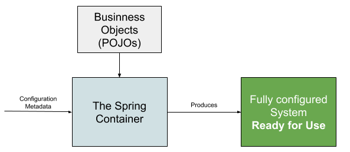
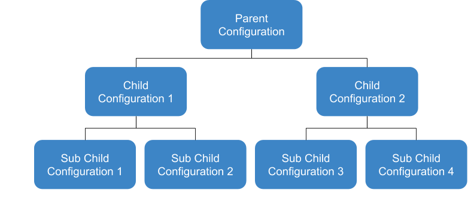

**Spring Overview**

“Spring framework is a Java platform that provides comprehensive infrastructure support for developing Java applications. Spring handles the infrastructure so you can focus on your application” 

**Introducing objects dependencies**

A Java Application is a collection of Objects. In a good application we will have several objects with their own responsibilities. And those objects can be dependent on each other.

**Example:**

UserService depends on UserRepository

So a way to do is like this:

```java
public class UserService {
    
    private UserRepository repository;
        public UserService() {
        UserRepository repository = new UserRepository();
        this.repository = repository;
    
    }
    
    public void create() {
        repository.save(new User(1L, "Sebastian"));
    }

}
```

**Traditional Way of dependency injection - Drawbacks**

The developer are responsible to manage the object dependencies and object creation

He is also responsible for initializing and providing dependencies to child objects. It can be daunting when there are a large number of them

**Spring Way of dependency injection**


*   We only need to declare and let Spring inject the dependencies for us
*   Spring IoC container is here to help - We provide Spring container bean definitions and let it manage the object creation, initialization, assembling and also manage the dependency graph.
*   Bean definition can be provided through XML bean definition configuration file or through Java annotations

**How Spring IoC Container works**




**Concept of POJOs and Beans**

“In software engineering, a **P**lain **O**ld **J**ava **O**bject (**POJO**) is an **ordinary Java object, not bound by any special restriction** and not requiring any class path”

A POJO cannot implement or extends any other classes that needs a class path.

When a POJO is inside of a Spring IoC container it is known as Beans.

**Spring IoC Container**

The `org.springframework.beans` and `org.springframework.context` packages are the basis for Spring Framework's IoC container. The `BeanFactory` interface provides an advanced configuration mechanism capable of managing any type of object. `ApplicationContext` is a sub-interface of BeanFactory. It adds easier integration with Spring's AOP features; message resource handling (for use in internationalization), event publication; and application-layer specific contexts such as the `WebApplicationContext` for use in web applications.

In short, the `BeanFactory` provides the configuration framework and basic functionality, and the `ApplicationContext` adds more enterprise-specific functionality. The ApplicationContext is a complete superset of the BeanFactory

*   ApplicationContext interface represents the Spring IoC Container
*   It is responsible for instantiating, configuring, and assembling the beans
*   Container get its instructions on what objects to instantiate, configure and assemble by reading configuration metadata

There is two different ways of configuring a bean:

**Configuration Metadata - XML File**

```xml
<?xml version="1.0" encoding="utf-8" ?>
<beans xmlns="http://www.springframework.org/schema/beans"
    xmlns:xsi="http://www.w3.org/2001/XMLSchema-instance"
    xsi:schemaLocation="http://www.springframework.org/schema/beans
    http://www.springframework.org/schema/beans/spring-beans.xsd">

    <bean id="product" class="spring.core.xml.config.Product">
        <constructor-arg name="id" value="A123" />
        <constructor-arg name="name" value="Notebook" />
        <constructor-arg name="productDescription" value="Awesome notebook from Acer TM" />
    </bean>

    <bean id="product2" class="spring.core.xml.config.Product">
        <constructor-arg name="id" value="B666" />
        <constructor-arg name="name" value="SmartPhone" />
        <constructor-arg name="productDescription" value="Very nice Fone" />
    </bean>
</beans>
```

**Configuration Metadata - Java Config**

```java
package spring.core.java.annotation.config;

import org.springframework.context.annotation.Bean;
import org.springframework.context.annotation.Configuration;

@Configuration
public class ArtistConfiguration {

    @Bean
    public Artist artist() {
        return new Artist("Filipe", "Tagliacozzi");
    }

    /*@Bean("AnotherArtist")
    public Artist artist() {
        return new Artist("Sebastian", "Doe");
    }*/

}

```

In annotation configuration of a bean the method name will be the name of the bean inside IoC container or a name given in this way: 
```java
@Bean(name = "nameOfBean")
```
**BeanFactory Interface**


*   Spring’s Dependency Injection functionality is implemented using this BeanFactory interface and its subinterfaces.
*   This is the root interface for accessing a Spring bean container
*   This is the basic client view of a bean container
*   This interface is implemented by objects that hold a number of bean definitions, each uniquely identified by a String name

**ApplicationContext Interface**

*   Central interface to provide configuration for a Spring application
*   This is read-only while the application is running, but may be reloaded if the implementation support this
*   Implement various other interfaces that provides useful features, such as:
    *   EnvironmentCapable
    *   MessageSource
    *   ApplicationEventPublisher

**Demonstration**


**We can inject that dependency by Constructor or by a Setter method. **

Since you can mix constructor-based and setter-based dependency injection, it is a good rule that you use constructor for mandatory dependencies and setter for optional dependencies.

The Spring team generally advocates constructor injection as it lets you implement components as immutable objects and ensures that required dependencies are not null. Furthermore, constructor-injected components are always returned to the client code in a fully initialized state. As a side note, a large amount of constructor arguments is a bad code smell, implying that the class likely has too many responsibilities and should be refactored to better address proper separation of concerns.

Setter injection should primarily only be used for optional dependencies that can be assigned reasonable default values within the class. Otherwise, not-null checks must be performed everywhere the code uses the dependency. One benefit of setter injection is that you can reinject dependencies when you need to.

**Dependency Resolution Process**


*   The ApplicationContext is created and initialized with configuration metadata
*   For each bean, its dependencies are expressed in the form of properties, constructor arguments or arguments to the static-factory method
*   Each property or constructor argument that is a value is converted from its specified format to the actual type of that property or constructor argument
*   The Spring container validates the configuration of each bean as the container is created

**Circular Dependency**

*   If we use predominantly constructor injection, it is possible to create an unresolvable circular dependency scenario
*   For example: **Class A** requires an instance of **Class B** through constructor injection, and class B requires an instance of Class A through constructor injection.
*   If we configure beans for classes **A** and **B** to be injected into each other, the **Spring IoC** container detects this circular reference at runtime and throw a **BeanCurrentlyCreationException**


**Importing XML Configurations**



An example of importing bean configuration:

Declaring:
```xml
<?xml version="1.0" encoding="utf-8" ?>
<beans xmlns="http://www.springframework.org/schema/beans"
    xmlns:xsi="http://www.w3.org/2001/XMLSchema-instance"
    xsi:schemaLocation="http://www.springframework.org/schema/beans
    http://www.springframework.org/schema/beans/spring-beans.xsd">

    <bean id="instrument" class="spring.core.bean.imports.Instrument">
        <property name="id" value="85" />
        <property name="name" value="Acoustic Guitar" />
    </bean>
</beans>
```

Importing:
```xml
<?xml version="1.0" encoding="utf-8" ?>
<beans xmlns="http://www.springframework.org/schema/beans"
    xmlns:xsi="http://www.w3.org/2001/XMLSchema-instance"
    xsi:schemaLocation="http://www.springframework.org/schema/beans
    http://www.springframework.org/schema/beans/spring-beans.xsd">

    <import resource="applicationContextBeanImport-instrument.xml" />

    <bean id="artist" class="spring.core.bean.imports.Artist">
        <property name="name" value="Jhonny Boy" />
        <property name="instrument" ref="instrument" />
    </bean>
</beans>
```

**Inner Bean**

Another way of declaring a dependency bean inside another is defining a `<bean />` element inside the `<property />` or `<constructor-arg />` elements. It defines an inner bean.

```xml
<import resource="applicationContextBeanImport-instrument.xml" />

<bean id="artist" class="spring.core.bean.imports.Artist">
    <property name="name" value="Jhonny Boy" />
    <property name="instrument">
        <bean class="spring.core.bean.imports.Instrument">
            <property name="id" value="88" />
            <property name="name" value="Eletric Piano" />
        </bean>
    </property>
</bean>
```
**Handling Java Collections**

We can populate sets, lists and maps by creating a application context XML configuration like below:

```xml
<?xml version="1.0" encoding="utf-8" ?>
<beans xmlns="http://www.springframework.org/schema/beans"
    xmlns:xsi="http://www.w3.org/2001/XMLSchema-instance"
    xsi:schemaLocation="http://www.springframework.org/schema/beans
    http://www.springframework.org/schema/beans/spring-beans.xsd">

    <bean id="collection" class="spring.core.collections.CollectionHolder">
        <property name="myList">
            <list>
                <value>List 1</value>
                <value>List 2</value>
            </list>
        </property>
        <property name="mySet">
            <set>
                <value>Set 1</value>
                <value>Set 2</value>
            </set>
        </property>
        <property name="myMap">
            <map>
                <entry key="Key 1" value="value 2" />
                <entry key="Key 2" value="value 3" />
                <entry key="Key 3" value="value 3" />
            </map>
        </property>
        <property name="myPlayers">
            <list>
                <ref bean="player1" />
                <ref bean="player2" />
                <ref bean="player3" />
            </list>
        </property>
        <property name="properties">
            <props>
                <prop key="username">admin</prop>
                <prop key="password">admin</prop>
                <prop key="dataSourceUrl">http://localhost:3060</prop>
            </props>
        </property>
    </bean>
    <bean id="player1" class="spring.core.collections.Player">
        <property name="id" value="1" />
        <property name="name" value="Filipe Player" />
    </bean>
    <bean id="player2" class="spring.core.collections.Player">
        <constructor-arg name="id" value="2" />
        <constructor-arg name="name" value="Jhonny Player" />
    </bean>
    <bean id="player3" class="spring.core.collections.Player">
        <constructor-arg name="id" value="3" />
        <constructor-arg name="name" value="Bastião Player" />
    </bean>
</beans>
```

**Merging Collections**

Spring can deal with merging similar collections of two classes. An example is, if we have a **Abstract Class A** and another **Class B** that extends from it and both have similar properties then Spring will merge those properties.
We need to declare child property->props with the attribute `merge=true`. 

```xml
<?xml version="1.0" encoding="utf-8" ?>
<beans xmlns="http://www.springframework.org/schema/beans"
    xmlns:xsi="http://www.w3.org/2001/XMLSchema-instance"
    xsi:schemaLocation="http://www.springframework.org/schema/beans
    http://www.springframework.org/schema/beans/spring-beans.xsd">

    <bean id="details" abstract="true" class="spring.core.collections.merging.Details">
        <property name="details">
            <props>
                <prop key="email1">admin@admin.com</prop>
            </props>
        </property>
    </bean>
    <bean id="userDetails" parent="details" class="spring.core.collections.merging.UserDetails">
        <property name="details">
            <props merge="true">
                <prop key="email2">admin2@admin2.com</prop>
            </props>
        </property>
    </bean>
</beans>
```
## Depends On ##
- At times, we want to force the container to load one or more bean 
before the dependent bean is loaded
- With depends-on, Spring IoC initializes depending beans before craeating the actual bean
- In the similar way, Spring destroys the depending beans first and then the actural bean

To see it happen we make a configure XML creating first a bean thats depends on another bean:
```xml
    <bean depends-on="init" id="initializer-dependent" class="spring.core.bean.depends.on.InitializerDependent" />
    <bean id="init" class="spring.core.bean.depends.on.Initializer" />
```
Later we get the "dependent" bean from IoC container: 

```java
public class InitializerMain {
    public static void main(String[] args) {
        ApplicationContext applicationContext = new ClassPathXmlApplicationContext("applicationContextDependsOn.xml");
        InitializerDependent initializer = applicationContext.getBean(InitializerDependent.class);
    }
}
```
And we see in stdout that both beans was loaded: 
```shell script
class spring.core.bean.depends.on.Initializer was initialized.
class spring.core.bean.depends.on.InitializerDependent was initialized.
```

## Lazy Initizlization ##

- By default Spring loads bean with eager initialization, Spring IoC container will load all 
beans, even if we not use it.
- However, it's possible to load beans on a lazy loading basis.
- For lazy loading initialization we need to set `lazy-init=true` into bean configuration properties

```xml
<bean id="lazy-initialized" lazy-init="true" class="spring.core.bean.lazy.inicialization.LazyInitializedBean">
    <constructor-arg name="helloPhrase" value="This bean was initialized lazily" />
</bean>
```


## Loading Multiple XML files in same container ##


There are three ways of dependency injection that will be managed by Spring IoC container.


```java
 
// 1 - By Autowired annotation
@Autowired
private UserRepository repository;

// 2 - By constructor parameter
public UserService(UserRepository repository) {
    this.repository = repository;
}         

// 3 - By Setter method
public void setRepository(UserRepository repository){
    this.repository;
}

```